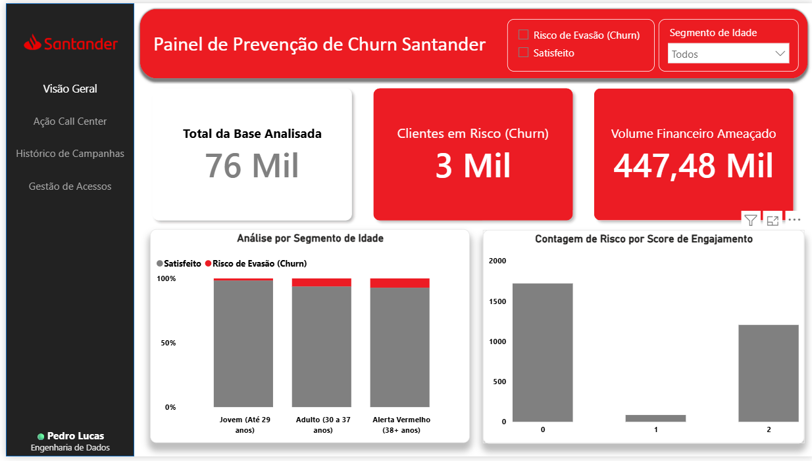
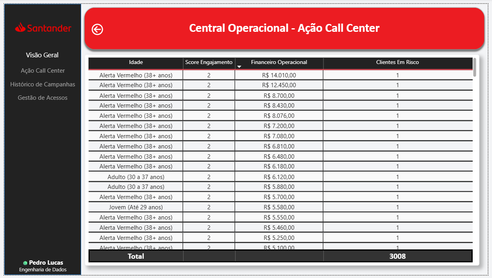

# 🏦 Arquitetura de Dados e Analytics: Prevenção de Churn Bancário

## 📌 Escopo e Objetivo do Projeto
O setor financeiro exige respostas rápidas e seguras para mitigar a evasão de capital. Este projeto não é apenas um painel de visualização, mas uma solução de **Analytics Engineering** de ponta a ponta. O objetivo foi arquitetar um fluxo de dados robusto que processa, modela e distribui informações táticas de risco de *churn* (cancelamento), conectando a estratégia gerencial à operação tática de Call Center, sob rígidas regras de governança de dados.

## 🏗️ Arquitetura da Solução e Stack Tecnológica
O pipeline foi desenhado respeitando as melhores práticas de otimização, empurrando a carga de processamento para o banco de dados (*Shift-Left*) e garantindo segurança no consumo na nuvem.

* **Python (Pandas):** Responsável pela camada de ingestão inicial e Análise Exploratória de Dados (EDA). Limpeza, tipagem e preparação da base de treino/teste do Santander.
* **PostgreSQL & DBeaver:** Armazenamento e modelagem relacional. Toda a lógica de transformação pesada foi encapsulada em **Views** materializadas no banco de dados, reduzindo o custo de processamento na ferramenta de BI.
* **Power BI & DAX:** Camada semântica e de visualização. Desenvolvimento de métricas complexas de retenção, risco e volume financeiro utilizando DAX avançado.
* **Power BI Gateway:** Infraestrutura de automação híbrida. Configuração do Gateway para permitir que o serviço na nuvem consulte o PostgreSQL local e execute atualizações incrementais automáticas.
* **Row-Level Security (RLS):** Implementação de Governança de Dados. Criação de perfis de segurança dinâmicos para garantir que operadores visualizem estritamente os dados de clientes permitidos pela sua hierarquia ou região.

## 📊 Interfaces e UX/UI (Suporte à Decisão)

O produto final foi fatiado em duas camadas de acesso, utilizando técnicas de *Drill-through* para reduzir a carga cognitiva do usuário:

### 1. Visão Gerencial (Nível Estratégico)
Painel macro focado em anomalias de risco e impacto no volume financeiro.
> *(Nesta interface, a diretoria identifica o público-alvo com risco iminente de evasão).*

### 2. Central Operacional - Call Center (Nível Tático)
Página oculta na hierarquia do menu, acessível exclusivamente via *Drill-through* a partir de cruzamentos específicos (ex: Clientes Score 0 com Alta Renda). 
> *(Lista nominal de ação imediata ordenada por Volume Financeiro Operacional decrescente, otimizando o esforço da equipe de retenção).*

## ⚙️ Destaques Técnicos do Desenvolvimento
1. **Modelagem de Dados Escalável:** Em vez de importar tabelas flat pesadas via Power Query, a estrutura foi desenhada com consultas diretas e Views SQL, garantindo escalabilidade caso a volumetria do banco escale para milhões de linhas.
2. **Design de Navegação (UX/UI):** Remoção de ruídos visuais. Uso de *UI Shell* padronizado (barras laterais escuras) e contraste funcional para guiar a atenção do usuário.
3. **Governança (RLS):** Aplicação prática dos conceitos de segurança da informação (CIA Triad - Confidencialidade, Integridade e Disponibilidade) aplicados à camada de Analytics.

## 🚀 Como Reproduzir o Ambiente
1. Clone este repositório: `git clone https://github.com/pedrolucasds/projeto-santander-churn.git`
2. Utilize os *scripts* localizados na pasta `/sql` para recriar as Views no seu ambiente PostgreSQL local.
3. Certifique-se de que as credenciais no arquivo `Dashboard_Santander_Churn.pbix` estejam apontando para o `localhost:5432`.
4. Para simular a governança, acesse a aba "Modelagem > Exibir como" no Power BI Desktop e selecione uma das funções RLS configuradas.